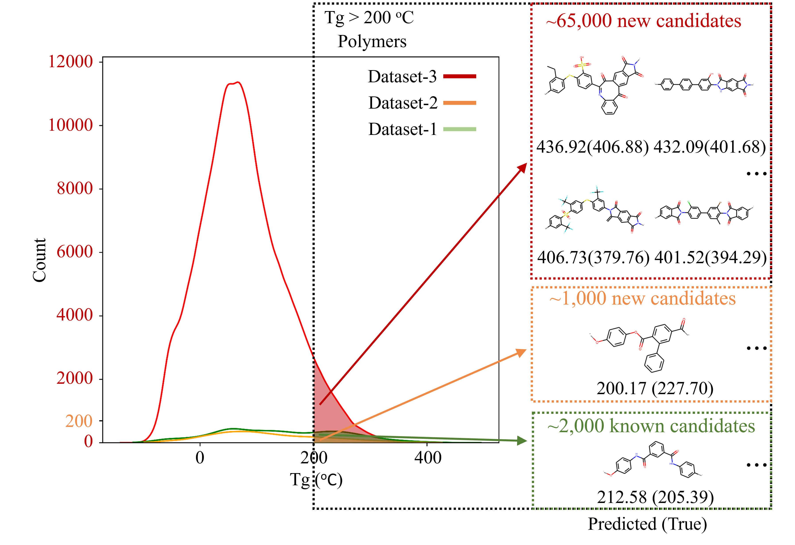

# Polymer_Tg_
Code and data for the paper [Machine Learning Discovery of High-Temperature Polymers](https://www.sciencedirect.com/science/article/pii/S2666389921000398).

# Data
- All the polymer data can be found in the PolyInfo database https://polymer.nims.go.jp/en/ (National Institute for Materials Science (NIMS) holds the copyright of this database system).

# model
The trained DNN model using fingerprints can be found in /Model to reproduce the results.
